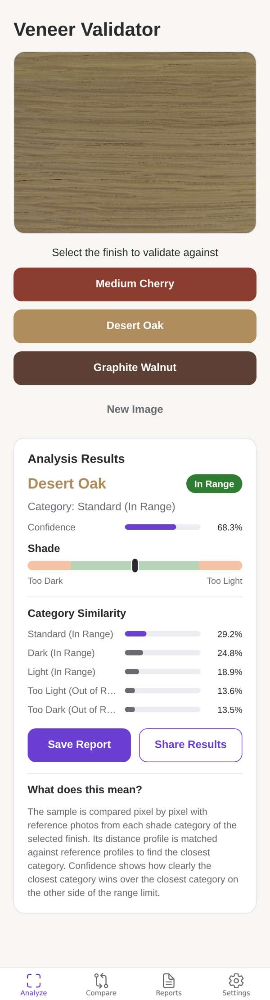
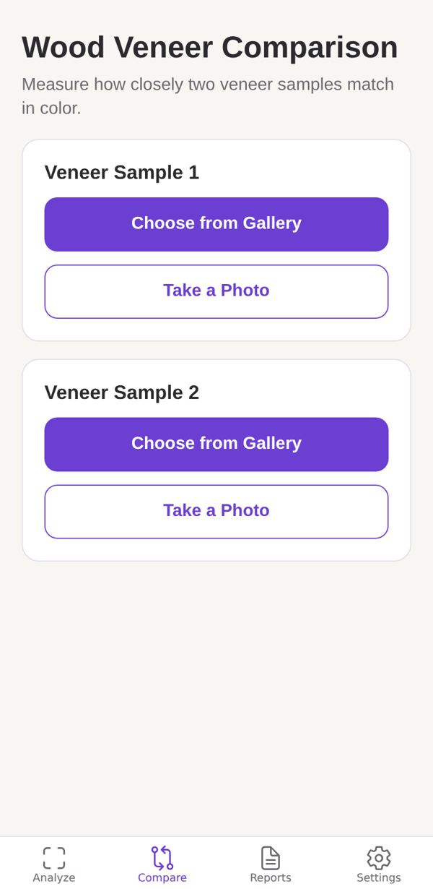

# TrueHue: Veneer Color Validator

TrueHue checks whether a wood veneer sample matches its finish specification from a single photo. Quality assurance and field engineers photograph a sample, pick the finish, and get an in-range or out-of-range verdict with the closest shade category in seconds.

It runs as a web app, and the same codebase builds native iOS and Android apps with Expo.

**Live demo:** _add your Azure URL here after running `./deploy/azure-deploy.sh`_

<p align="center">
  
  &nbsp;&nbsp;
  
</p>

## Built for Steelcase

TrueHue was developed for [Steelcase Inc.](https://www.steelcase.com/), a global leader in office furniture and workspace design. Consistent veneer color is critical to Steelcase's finish standards, and manual visual inspection is slow and subjective. TrueHue makes that check fast, repeatable, and recorded.

## Features

- **Validate a sample** against Medium Cherry, Desert Oak, or Graphite Walnut. See the verdict, the predicted shade category (too light, light, standard, dark, too dark), a confidence score, and how similar the sample is to every category.
- **Compare two samples** side by side to measure how closely their colors match.
- **Save and browse reports** in the cloud (Firebase), with filters by date, finish, and result, plus sharing.
- **Five languages** (English, Spanish, French, German, Chinese), a dark mode, and optional notifications on mobile.

## Results

Accuracy of the in-range / out-of-range verdict across the full labeled dataset of 380 photos:

| Finish          | Samples | Overall | In-range samples | Out-of-range samples |
| --------------- | ------: | ------: | ---------------: | -------------------: |
| Desert Oak      |     110 |   92.7% |           100.0% |                83.0% |
| Graphite Walnut |     149 |   91.9% |            93.4% |                89.7% |
| Medium Cherry   |     121 |   79.3% |            84.6% |                69.8% |

These numbers are enforced by an automated test (`backend/tests/test_accuracy.py`), so a change that degrades the classifier fails CI.

## How it works

1. The photo is resized to 300 x 300 and compared pixel by pixel with 20 reference photos from each of the five shade categories of the chosen finish. The mean RGB distance to each category forms the sample's **distance profile**.
2. That profile is compared with reference profiles computed from the labeled dataset (`backend/data/profiles`). The closest reference profile gives the predicted category, and the category determines whether the sample is in range.
3. **Confidence** shows how clearly the closest category beats the closest category on the other side of the range limit (50% means a tie, 100% means no contest).

Reference photos are decoded once at startup (or precomputed into a cache during the Docker build), so each analysis takes about a quarter of a second.

## Architecture

```
Browser / iOS / Android  (Expo + React Native, TypeScript)
        │  POST /api/classify, /api/compare
        ▼
Flask API  (Python, NumPy, Pillow)  ── also serves the web build
        │
Firebase  (Firestore for reports, Storage for report photos)
```

In production a single container serves both the web app and the API, so the site and API share one URL with no CORS or configuration to manage.

## Project structure

```
.
├── TrueHue/                 # Expo app (web, iOS, Android)
│   ├── app/(tabs)/          # Screens: Analyze, Compare, Reports, Settings
│   ├── components/ui.tsx    # Shared UI components
│   ├── lib/                 # API client, Firebase, settings and theming
│   └── i18n/strings.ts      # UI text in five languages
├── backend/
│   ├── app/                 # Flask app and classifier
│   ├── data/                # Reference photos and reference profiles
│   ├── scripts/             # Reference cache builder
│   └── tests/               # API and accuracy tests
├── deploy/azure-deploy.sh   # One-command Azure deployment
├── Dockerfile               # Production image (web build + API)
└── docs/                    # Final report and original v1 installation guide
```

## Getting started

Prerequisites: [Python 3.11+](https://www.python.org/downloads/) and [Node.js 20+](https://nodejs.org/). On macOS (including Apple Silicon):

```bash
brew install python@3.12 node@20
```

### 1. Run the API

```bash
cd backend
python3 -m venv .venv
source .venv/bin/activate
pip install -r requirements-dev.txt
python wsgi.py            # http://localhost:3050
```

### 2. Run the app

In a second terminal:

```bash
cd TrueHue
npm install
EXPO_PUBLIC_API_URL=http://localhost:3050 npx expo start
```

Press `w` to open it in a browser, or scan the QR code with [Expo Go](https://expo.dev/go). On a physical phone, replace `localhost` with your computer's local IP address (`ipconfig getifaddr en0` on macOS).

### Or run everything with Docker

```bash
docker compose up --build   # http://localhost:8000
```

## Testing

```bash
cd backend && python -m pytest                # API tests and accuracy checks
cd backend && python -m pytest -m "not slow"  # skip the full-dataset accuracy run
cd TrueHue && npm run typecheck
```

GitHub Actions runs the backend tests, the TypeScript check, and the web build on every push and pull request.

## Deploying to Azure

The app deploys to [Azure Container Apps](https://learn.microsoft.com/azure/container-apps/) with one command. The image is built in the cloud, so it works the same from an Apple Silicon Mac.

```bash
brew install azure-cli
az login
./deploy/azure-deploy.sh
```

The script prints the public URL when the app is ready. Run it again to deploy updates. The app scales to zero when idle, so the first request after a quiet period takes a few extra seconds.

## API

| Method | Path           | Body                                   | Returns                                                                                  |
| ------ | -------------- | -------------------------------------- | ---------------------------------------------------------------------------------------- |
| GET    | `/api/health`  |                                        | Status, supported finishes and categories                                                |
| POST   | `/api/classify`| `{ "image": "<base64>", "wood": "desert-oak" }` | `in_range`, `predicted_category`, `confidence`, `similarity_scores`, `distance_profile` |
| POST   | `/api/compare` | `{ "image1": "<base64>", "image2": "<base64>" }` | `difference` (mean RGB distance) and `normalized_difference` (0 to 100)          |

`wood` is one of `medium-cherry`, `desert-oak`, or `graphite-walnut`. Images may be plain base64 or data URLs.

## Known limitations

- Lighting matters: strong shadows or color casts can shift results. Photograph samples under consistent, neutral light.
- Saved reports use a shared Firebase project without user accounts. Add Firebase Authentication and tighten the security rules before storing sensitive data.

## Documentation

- [Final report and detailed design](docs/final-report.pdf)
- [Original v1.0 installation guide](docs/installation-guide-v1.pdf) (superseded by this README)

## Team

- **Rishi Manimaran**, Project Lead
- Benson Lin, Frontend Developer
- Jihoon Kim, Frontend Developer
- Zhihui Chen, Backend Developer
- Zuhair Al Araf, Backend Developer

## License

[MIT](LICENSE)
