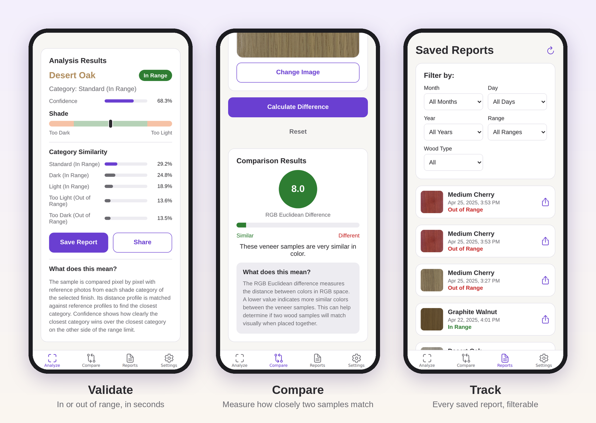

<h1 align="center">TrueHue</h1>

<p align="center">
  <strong>Color quality control for wood veneer, from a single photo.</strong><br>
  Snap a sample, pick the finish, and know in under a second whether it meets spec.
</p>

<p align="center">
  <a href="https://github.com/rishimj/trueHue/actions/workflows/ci.yml"></a>
  
  
  
  
  <a href="LICENSE"></a>
</p>

<p align="center">
  <strong>Live demo:</strong> <em>coming soon</em>
</p>

<p align="center">
  
</p>

## Why TrueHue

Furniture makers promise customers that a "Desert Oak" desk matches the "Desert Oak" cabinet next to it. Today that promise is checked by eye: an inspector holds a sample next to a reference chip and makes a judgment call. It is slow, subjective, and leaves no record.

TrueHue turns that judgment call into a measurement. It was built for [Steelcase Inc.](https://www.steelcase.com/), a global leader in workplace furniture, to validate veneer finishes on the factory floor and in the field.

| 88% accurate | Under a second | Web, iOS, Android | Tested on every change |
| :---: | :---: | :---: | :---: |
| across 380 labeled photos of three finishes | about 0.25 s per analysis on one CPU | one codebase for every platform | accuracy tests run in CI |

## Features

- **Validate a sample** against Medium Cherry, Desert Oak, or Graphite Walnut. Get a clear in-range or out-of-range verdict, the exact shade category (too light, light, standard, dark, too dark), a confidence score, and a similarity breakdown across every category.
- **Compare two samples** side by side to see how closely their colors match before parts are paired.
- **Keep a record.** Save results with the photo to the cloud, then filter by date, finish, and result, or share a report in one tap.
- **Ready for global teams** with five languages (English, Spanish, French, German, Chinese), dark mode, and completion notifications on mobile.

## Results

Accuracy of the in-range / out-of-range verdict across the full labeled dataset of 380 photos:

| Finish          | Samples | Overall | In-range samples | Out-of-range samples |
| --------------- | ------: | ------: | ---------------: | -------------------: |
| Desert Oak      |     110 |   92.7% |           100.0% |                83.0% |
| Graphite Walnut |     149 |   91.9% |            93.4% |                89.7% |
| Medium Cherry   |     121 |   79.3% |            84.6% |                69.8% |

These numbers are enforced by an automated test (`backend/tests/test_accuracy.py`), so a change that degrades the classifier fails CI.

## How it works

1. The photo is resized to 300 x 300 and compared pixel by pixel with 20 reference photos from each of the five shade categories of the chosen finish. The mean RGB distance to each category forms the sample's **distance profile**.
2. That profile is compared with reference profiles computed from the labeled dataset (`backend/data/profiles`). The closest reference profile gives the predicted category, and the category determines whether the sample is in range.
3. **Confidence** shows how clearly the closest category beats the closest category on the other side of the range limit (50% means a tie, 100% means no contest).

Reference photos are decoded once at startup (or precomputed into a cache during the Docker build), so each analysis takes about a quarter of a second.

## Architecture

```
Browser / iOS / Android  (Expo + React Native, TypeScript)
        │  POST /api/classify, /api/compare
        ▼
Flask API  (Python, NumPy, Pillow)  ── also serves the web build
        │
Firebase  (Firestore for reports, Storage for report photos)
```

In production a single container serves both the web app and the API, so the site and API share one URL with no CORS or configuration to manage.

## Project structure

```
.
├── TrueHue/                 # Expo app (web, iOS, Android)
│   ├── app/(tabs)/          # Screens: Analyze, Compare, Reports, Settings
│   ├── components/ui.tsx    # Shared UI components
│   ├── lib/                 # API client, Firebase, settings and theming
│   └── i18n/strings.ts      # UI text in five languages
├── backend/
│   ├── app/                 # Flask app and classifier
│   ├── data/                # Reference photos and reference profiles
│   ├── scripts/             # Reference cache builder
│   └── tests/               # API and accuracy tests
├── deploy/azure-deploy.sh   # One-command Azure deployment
├── Dockerfile               # Production image (web build + API)
└── docs/                    # Final report and original v1 installation guide
```

## Getting started

Prerequisites: [Python 3.11+](https://www.python.org/downloads/) and [Node.js 20+](https://nodejs.org/). On macOS (including Apple Silicon):

```bash
brew install python@3.12 node@20
```

### 1. Run the API

```bash
cd backend
python3 -m venv .venv
source .venv/bin/activate
pip install -r requirements-dev.txt
python wsgi.py            # http://localhost:3050
```

### 2. Run the app

In a second terminal:

```bash
cd TrueHue
npm install
EXPO_PUBLIC_API_URL=http://localhost:3050 npx expo start
```

Press `w` to open it in a browser, or scan the QR code with [Expo Go](https://expo.dev/go). On a physical phone, replace `localhost` with your computer's local IP address (`ipconfig getifaddr en0` on macOS).

### Or run everything with Docker

```bash
docker compose up --build   # http://localhost:8000
```

## Testing

```bash
cd backend && python -m pytest                # API tests and accuracy checks
cd backend && python -m pytest -m "not slow"  # skip the full-dataset accuracy run
cd TrueHue && npm run typecheck
```

GitHub Actions runs the backend tests, the TypeScript check, and the web build on every push and pull request.

## Deploying to Azure

The app deploys to [Azure Container Apps](https://learn.microsoft.com/azure/container-apps/) with one command. The image is built in the cloud, so it works the same from an Apple Silicon Mac.

```bash
brew install azure-cli
az login
./deploy/azure-deploy.sh
```

The script prints the public URL when the app is ready. Run it again to deploy updates. The app scales to zero when idle, so the first request after a quiet period takes a few extra seconds.

## API

| Method | Path           | Body                                   | Returns                                                                                  |
| ------ | -------------- | -------------------------------------- | ---------------------------------------------------------------------------------------- |
| GET    | `/api/health`  |                                        | Status, supported finishes and categories                                                |
| POST   | `/api/classify`| `{ "image": "<base64>", "wood": "desert-oak" }` | `in_range`, `predicted_category`, `confidence`, `similarity_scores`, `distance_profile` |
| POST   | `/api/compare` | `{ "image1": "<base64>", "image2": "<base64>" }` | `difference` (mean RGB distance) and `normalized_difference` (0 to 100)          |

`wood` is one of `medium-cherry`, `desert-oak`, or `graphite-walnut`. Images may be plain base64 or data URLs.

## Known limitations

- Lighting matters: strong shadows or color casts can shift results. Photograph samples under consistent, neutral light.
- Saved reports use a shared Firebase project without user accounts. Add Firebase Authentication and tighten the security rules before storing sensitive data.

## Documentation

- [Final report and detailed design](docs/final-report.pdf)
- [Original v1.0 installation guide](docs/installation-guide-v1.pdf) (superseded by this README)

## License

[MIT](LICENSE)
